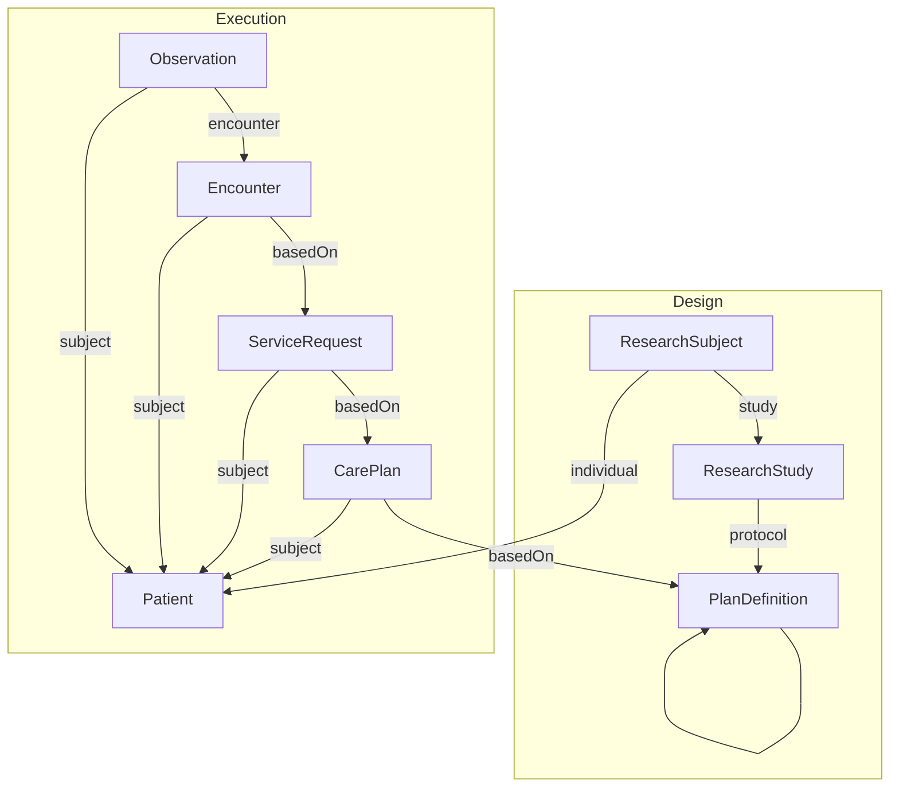

# Understanding the Data

This document shows how we expect the data to be structured.

Key entities:
* [ResearchStudy](https://hl7.org/fhir/ResearchStudy.html) - Registers the Study
* [ResearchSubject](https://hl7.org/fhir/ResearchSubject.html) - Links a Patient to a Study
* [PlanDefinition](https://hl7.org/fhir/PlanDefinition.html) - Defines the Planned Activities
* [Patient](https://hl7.org/fhir/Patient.html) - Individual within healthcare system
* [CarePlan](https://hl7.org/fhir/CarePlan.html) - Plans and executes the Planned Activities
* [ServiceRequest](https://hl7.org/fhir/ServiceRequest.html) - Schedules and requests activities
* [Encounter](https://hl7.org/fhir/Encounter.html) - interaction between a Patient and a Practitioner (models the visit)
* [Observation](https://hl7.org/fhir/Observation.html) - Observations about a Patient

## Design

We have used the following design to model how the subject data can be bound.



## Queries

1. Get the ResearchStudy
    ```
    https://api.logicahealth.org/soaconnectathon30/open/ResearchStudy?identifier=H2Q-MC-LZZT-ResearchStudy
    ```
2. Get the ResearchSubject by Subject ID
    ```
    https://api.logicahealth.org/soaconnectathon30/open/ResearchSubject?identifier=01-701-1118
    ```
3. Get the Protocol Definition
    ```
    https://api.logicahealth.org/soaconnectathon30/open/PlanDefinition?identifier=H2Q-MC-LZZT-ProtocolDesign
    ```
4. Get the PlannedVisit by OID
    ```
    https://api.logicahealth.org/soaconnectathon30/open/PlanDefinition?identifier=SE.TRT_VISIT_10
    ```