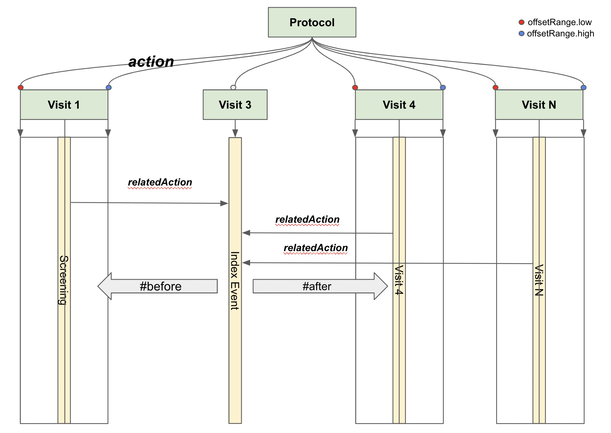
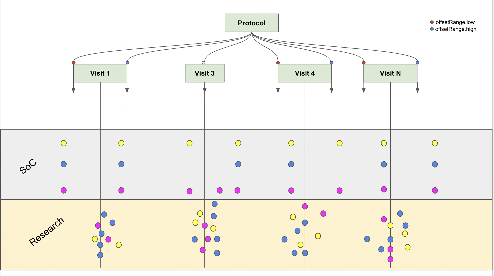

# Scenarios for Using the Study Design

## Visit alignment

The Workflow is as follows:
1. Identify the ResearchStudy (`ResearchStudy?_id=PROTOCOL_ID`)
2. Identify the Protocol Design **PlanDefinition** through the `protocol` field of the research study
3. Identify the initial activity:
   1. Iterate over the `action` elements in the **PlanDefinition** to extract the `relatedAction`  and `id` attributes (if present)
   2. The `relatedAction` these will have a reference to the `actionId` which is the `action.id` for the action we need to query
      1. Extract the `offsetRange` from the `relatedAction` and use this to define the `low` and `high` values for the `offset`
      2. Extract the `relationship` from the `relatedAction` and use this to define the `relationship`
   3. Record the `definitionUri` for the initial activity
4. Identify the Research Subject(`ResearchSubject?study=PROTOCOL_ID`)
5. Extract the Patient from the Research Subject through the `individual` field
6. Select the **CarePlan** for the Patient for the initial activity using the Patient id and the `definitionUri`
7. Select the **ServiceRequest** for the CarePlan (`ServiceRequest?patient=XXX&basedOn=CarePlan/TTTT`)
8. Select the **Encounter** for the ServiceRequest (`Encounter?patient=XXX&basedOn=ServiceRequest/YYYY`)
9. Extract the `period` from the `Encounter` and use this to define the `start`
10. For each of the related Actions use the `low` and `high` values to define the expected date
11. Identify the encounters
    1. For the naive example (CarePlan link not present) 
       1. Select the Encounters based on the expected times:
          1. For Green (`Encounter?patient=XXX&date={START}`) -> returns a result
          2. For Orange (`Encounter?patient=XXX&date=ge{START}&date=le{END}`) -> returns a result
          3. For Red we have no matching result
    2. For the CarePlan link present
       1. Select the Encounters based on the expected times:
          1. For Green (`Encounter?patient=XXX&date={START}&basedOn=ServiceRequest/TTTT`) -> returns a result
          2. For Orange (`Encounter?patient=XXX&date=ge{START}&date=le{END}&basedOn=ServiceRequest/TTTT`) -> returns a result
          3. For Red we have no matching result

An illustrated example is shown here:

## Observation Alignment 

In this diagram we illustrate the alignment of the different types of performed activities for a Patient in a study. Some can be attributed to research activities, whereas others are aligned with Standard of Care Activities.  
The approach in this case is very similar to the approach used in the previous section; in this case when you query for the Resources you can use a couple of approaches:
* Date based - using the queries above to filter the resources based on Patient plus expected or actual date from the PlanDefinition
* Defined Encounter - assuming we implement the PlanDefinition and the -..-> Encounter then the resources can be filtered based on the Patient and the `encounter` field
* Defined Activity binding - looking at the ServiceRequest resources and using the `basedOn` field to filter the resources

## Summary
Using this approach we can build up a structured set of Queries based on our simple Workflow based model.  

However, this study is not a complete model, and we will need to continue to refine and add more approaches to the model. There is no dynamics, no branching, arms are not differerentiated, etc. 

One immediate benefit we can see is the `offset[*]` relationship would stand to be augmented with a `target` attribute.  This would allow the system to be more proscriptive in how it defines when activities are performed. 