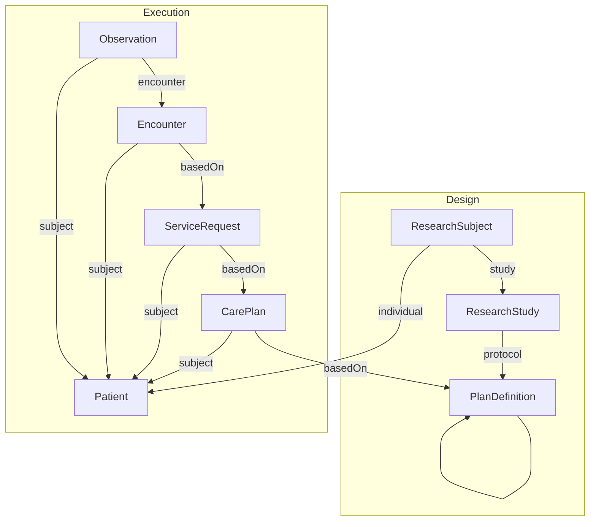

# Getting the source file

Download it from:
* https://sourceforge.net/projects/fhirloinc2sdtm/files/LZZT_Study_Bundle/

Run the script:
```
python patch_json.py LZZT_FHIR_Bundle_10_Patients_All_Resources.json
```

The files herein are:
* [LZZT_FHIR_Bundle_10_Patients_All_Resources.json]() - the source FHIR bundled copied from the link above
* [LZZT_FHIR_Bundle_10_Patients_All_Resources_Patched.json]() - the patched FHIR bundle


## Design

